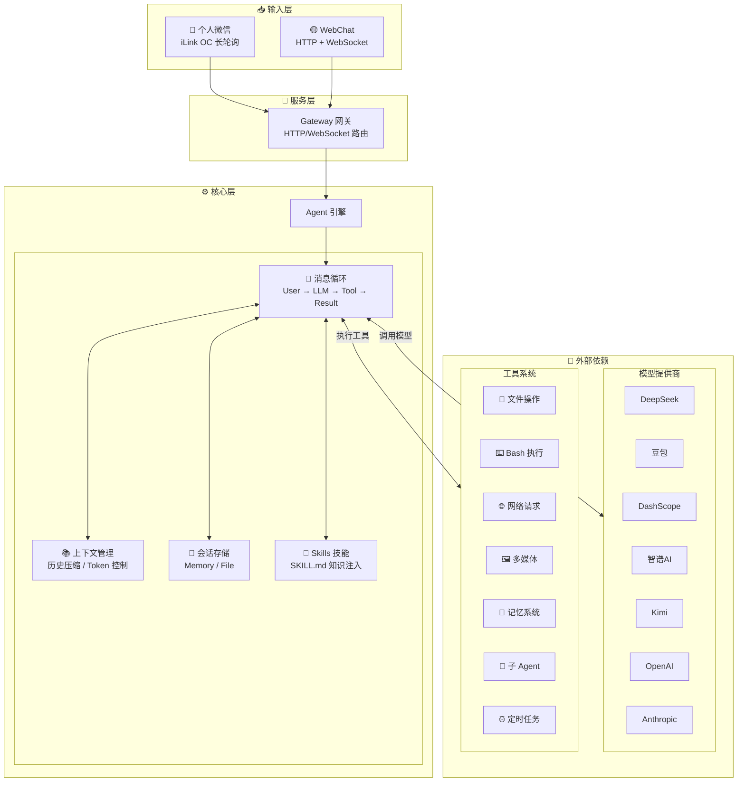

<p align="center">
  
</p>

<p align="center">
  <a href="./README_EN.md">English</a> | 中文
</p>

**支持国产大模型和个人微信的智能助手框架**

Vex 是一个轻量级的 AI 助手框架，专注于国产生态。基于 [pi-coding-agent](https://github.com/nicemicro/pi-coding-agent) 构建 Agent 运行时（内置会话管理、上下文压缩、工具执行），使用 [pi-ai](https://github.com/nicemicro/pi-ai) 作为统一的多模型调用层（支持 25+ 提供商），原生支持 Function Calling，并通过 iLink OC API 接入个人微信。

> 从 [OpenMozi](https://github.com/King-Chau/mozi) (Apache 2.0) 分叉，精简为个人微信特化版并改名为 Vex。

## 核心特性

- **多模型支持** — 基于 pi-ai 统一调用层，支持 DeepSeek、豆包、DashScope (Qwen)、智谱AI、Kimi、阶跃星辰、MiniMax，以及 OpenAI/Anthropic/OpenRouter/Groq 等 25+ 提供商
- **个人微信通道** — 基于 iLink OC API，扫码登录，长轮询消息收发
- **Function Calling** — 基于 pi-coding-agent 的 Agent 运行时，原生支持工具调用循环
- **25 内置工具** — 文件读写、Bash 执行、代码搜索、网页获取、图像分析、浏览器自动化、记忆系统、定时任务等
- **Skills 技能系统** — 通过 SKILL.md 文件扩展 Agent 能力，支持自定义行为和专业知识注入
- **记忆系统** — 跨会话长期记忆，自动记住用户偏好和重要信息
- **定时任务 (Cron)** — 支持一次性、周期性、Cron 表达式三种调度方式
- **插件系统** — 可扩展的插件架构，支持自动发现和加载
- **浏览器自动化** — 基于 Playwright 的浏览器控制，支持多配置文件和截图
- **会话管理** — 上下文压缩、会话持久化、多轮对话
- **WebChat** — 内置 Web 聊天界面和控制台

## 快速开始

### 环境要求

- Node.js >= 18
- npm / pnpm / yarn
- **跨平台支持**：macOS、Linux、Windows

### 1. 安装

```bash
# 全局安装（推荐）
npm install -g vex-bot

# 或者克隆项目开发
git clone https://github.com/King-Chau/vex.git
cd vex && npm install && npm run build
```

### 2. 配置

运行配置向导（推荐）：

```bash
vex onboard
```

向导会引导你完成以下配置：
- **国产模型** — DeepSeek、豆包、智谱AI、DashScope、Kimi、阶跃星辰、MiniMax、ModelScope
- **自定义 OpenAI 兼容接口** — 支持任意 OpenAI API 格式的服务（如 vLLM、Ollama）
- **自定义 Anthropic 兼容接口** — 支持任意 Claude API 格式的服务
- **个人微信** — 启用后首次启动扫码登录
- **记忆系统** — 启用/禁用长期记忆、自定义存储目录

配置文件将保存到 `~/.vex/config.local.json5`。

也可以直接使用环境变量（快速体验）：

```bash
export DEEPSEEK_API_KEY=sk-your-key
```

### 3. 启动

```bash
# 仅 WebChat（无需配置通讯通道）
vex start --web-only

# 完整服务（WebChat + 个人微信）
vex start

# 克隆项目方式
npm start -- start --web-only
```

打开浏览器访问 `http://localhost:3000` 即可开始对话。

## 支持的模型提供商

> 底层基于 [pi-ai](https://github.com/nicemicro/pi-ai)，支持 25+ 模型提供商。以下为预配置的提供商，也可通过自定义接口接入任意 OpenAI/Anthropic 兼容服务。

### 国产模型

| 提供商 | 环境变量 | 说明 |
|--------|----------|------|
| DeepSeek | `DEEPSEEK_API_KEY` | 推理能力强、性价比高 |
| 豆包 | `DOUBAO_API_KEY` | 字节跳动火山引擎，Seed 深度思考系列，256k 上下文 |
| DashScope | `DASHSCOPE_API_KEY` | 阿里云灵积/百炼，通义千问商业版，稳定高并发 |
| 智谱 AI | `ZHIPU_API_KEY` | GLM-Z1/GLM-4/GLM-5 系列，清华技术团队，有免费额度 |
| ModelScope | `MODELSCOPE_API_KEY` | 阿里云魔搭社区，Qwen 开源版，有免费额度 |
| Kimi | `KIMI_API_KEY` | Kimi K2.5/Moonshot 系列，长上下文支持 |
| 阶跃星辰 | `STEPFUN_API_KEY` | Step-2/Step-1 系列，推理与多模态 |
| MiniMax | `MINIMAX_API_KEY` | MiniMax M2.5/M2.1/M3 系列，推理能力强 |

### 海外模型

| 提供商 | 环境变量 | 说明 |
|--------|----------|------|
| OpenAI | `OPENAI_API_KEY` | GPT-4o、o1、o3 系列 |
| Anthropic | `ANTHROPIC_API_KEY` | Claude 4 系列（通过 pi-ai 内置支持） |
| OpenRouter | `OPENROUTER_API_KEY` | 聚合多家模型，统一 API |
| Together AI | `TOGETHER_API_KEY` | 开源模型托管，Llama、Mixtral 等 |
| Groq | `GROQ_API_KEY` | 超快推理速度 |
| Google | `GOOGLE_API_KEY` | Gemini 系列（通过 pi-ai 内置支持） |

### 本地部署

| 提供商 | 环境变量 | 说明 |
|--------|----------|------|
| Ollama | `OLLAMA_BASE_URL` | 本地运行开源模型 |
| vLLM | `VLLM_BASE_URL` | 高性能本地推理服务 |

### 自定义接口

支持配置任意 OpenAI 或 Anthropic 兼容的 API 接口。通过 `vex onboard` 向导配置，或手动添加到配置文件：

```json5
{
  providers: {
    "custom-openai": {
      id: "my-provider",
      name: "My Provider",
      baseUrl: "https://api.example.com/v1",
      apiKey: "xxx",
      models: [
        {
          id: "model-id",
          name: "Model Name",
          contextWindow: 32768,
          maxTokens: 4096,
          supportsVision: false,
          supportsTools: true
        }
      ]
    },
    "custom-anthropic": {
      id: "my-anthropic",
      name: "My Anthropic",
      baseUrl: "https://api.example.com",
      apiKey: "xxx",
      apiVersion: "2023-06-01",
      models: [
        {
          id: "claude-3-5-sonnet",
          name: "Claude 3.5 Sonnet",
          contextWindow: 200000,
          maxTokens: 8192
        }
      ]
    }
  }
}
```

## 个人微信接入

基于 iLink OC API (`https://ilinkai.weixin.qq.com`)，使用扫码登录方式接入个人微信：

1. 在配置中启用微信通道（`vex onboard` 或手动设置 `channels.weixin.enabled: true`）
2. 启动服务 `vex start`
3. 终端或 WebUI 控制台显示二维码
4. 手机微信扫码确认登录
5. 获取 `bot_token` 后自动保存，下次启动直接复用

WebUI 控制台 (`http://localhost:3000/control`) 也提供扫码登录按钮。

## 配置参考

配置文件支持 `config.local.json5`、`config.json5`、`config.yaml` 等格式，优先级从高到低。存放在 `~/.vex/` 目录下。

<details>
<summary>完整配置示例</summary>

```json5
{
  providers: {
    deepseek: {
      apiKey: "sk-xxx"
    },
    dashscope: {
      apiKey: "sk-xxx"
    },
    zhipu: {
      apiKey: "xxx"
    }
  },

  channels: {
    weixin: {
      enabled: true,
      // 以下均为可选
      baseUrl: "https://ilinkai.weixin.qq.com",
      botType: "3"
    }
  },

  agent: {
    defaultProvider: "deepseek",
    defaultModel: "deepseek-chat",
    temperature: 0.7,
    maxTokens: 4096,
    systemPrompt: "你是Vex，一个智能助手。"
  },

  server: {
    port: 3000,
    host: "0.0.0.0"
  },

  logging: {
    level: "info"
  },

  skills: {
    enabled: true,
    userDir: "~/.vex/skills",
    workspaceDir: "./.vex/skills"
  },

  memory: {
    enabled: true,
    storageDir: "~/.vex/memory"
  }
}
```

</details>

## Skills 技能系统

Skills 是 Vex 的可扩展知识注入系统，通过编写 `SKILL.md` 文件，可以为 Agent 添加专业知识、自定义行为规则或领域能力，无需修改代码。

Skills 通过 YAML frontmatter + Markdown 内容的方式定义，启动时自动加载并注入到 Agent 的系统提示词中。

### 技能加载顺序

| 优先级 | 来源 | 目录 | 说明 |
|--------|------|------|------|
| 1 | 内置 | `skills/` | 项目自带的技能 |
| 2 | 用户级 | `~/.vex/skills/` | 用户自定义技能，所有项目共享 |
| 3 | 工作区级 | `./.vex/skills/` | 项目级技能，仅当前项目生效 |

> 同名技能按优先级覆盖，工作区级 > 用户级 > 内置。

### 编写 Skill

每个技能是一个目录，包含一个 `SKILL.md` 文件：

```markdown
---
name: greeting
title: 智能问候
description: 根据时间和场景提供个性化问候
version: "1.0"
tags:
  - greeting
  - chat
priority: 10
---

当用户向你打招呼或问候时，根据当前时间使用合适的问候语。
```

| 字段 | 类型 | 必填 | 说明 |
|------|------|------|------|
| `name` | string | 是 | 技能唯一标识 |
| `title` | string | 否 | 显示名称 |
| `description` | string | 否 | 技能描述 |
| `version` | string | 否 | 版本号 |
| `tags` | string[] | 否 | 标签，用于分类 |
| `priority` | number | 否 | 优先级，数值越大越靠前（默认 0） |
| `enabled` | boolean | 否 | 是否启用（默认 true） |

## 记忆系统

记忆系统让 Agent 能够跨会话记住重要信息。记忆默认启用，存储在 `~/.vex/memory/` 目录。

Agent 通过三个内置工具管理记忆：

| 工具 | 说明 |
|------|------|
| `memory_store` | 存储一条新记忆（包含内容和标签） |
| `memory_query` | 根据关键词查询相关记忆 |
| `memory_list` | 列出所有已存储的记忆 |

Agent 会在对话中自动判断何时需要存储或查询记忆。

## 定时任务 (Cron)

定时任务系统让 Agent 能够按计划执行任务：

| 调度类型 | 说明 | 示例 |
|----------|------|------|
| `at` | 一次性任务 | 在 2024-01-01 10:00 执行 |
| `every` | 周期性任务 | 每 30 分钟执行一次 |
| `cron` | Cron 表达式 | `0 9 * * *` 每天 9 点执行 |

任务类型：
- `systemEvent` — 简单的提醒、触发信号
- `agentTurn` — 执行 AI 对话，可投递结果到微信通道

Agent 通过 `cron_list`、`cron_add`、`cron_remove`、`cron_run`、`cron_update` 工具管理任务。任务数据存储在 `~/.vex/cron/jobs.json`。

## 内置工具

| 类别 | 工具 | 说明 |
|------|------|------|
| 文件 | `read_file` | 读取文件内容 |
| | `write_file` | 写入/创建文件 |
| | `edit_file` | 精确字符串替换 |
| | `list_directory` | 列出目录内容 |
| | `glob` | 按模式搜索文件 |
| | `grep` | 按内容搜索文件 |
| | `apply_patch` | 应用 diff 补丁 |
| 命令 | `bash` | 执行 Bash 命令 |
| | `process` | 管理后台进程 |
| 网络 | `web_search` | 网络搜索 |
| | `web_fetch` | 获取网页内容 |
| 多媒体 | `image_analyze` | 图像分析（需要视觉模型） |
| | `browser` | 浏览器自动化（需安装 Playwright） |
| 系统 | `current_time` | 获取当前时间 |
| | `calculator` | 数学计算 |
| | `delay` | 延时等待 |
| 记忆 | `memory_store` | 存储长期记忆 |
| | `memory_query` | 查询相关记忆 |
| | `memory_list` | 列出所有记忆 |
| 定时任务 | `cron_list` | 列出所有定时任务 |
| | `cron_add` | 添加定时任务 |
| | `cron_remove` | 删除定时任务 |
| | `cron_run` | 立即执行任务 |
| | `cron_update` | 更新任务状态 |
| Agent | `subagent` | 创建子 Agent 执行复杂任务 |

## CLI 命令

```bash
# 配置
vex onboard            # 配置向导
vex check              # 检查配置
vex models             # 列出可用模型

# 启动服务
vex start              # 完整服务（WebChat + 个人微信）
vex start --web-only   # 仅 WebChat
vex start --port 8080  # 指定端口

# 服务管理
vex status             # 查看服务状态
vex restart            # 重启服务
vex kill               # 停止服务（别名：vex stop）

# 聊天
vex chat               # 命令行聊天

# 日志
vex logs               # 查看最新日志（默认 50 行）
vex logs -n 100        # 查看最新 100 行
vex logs -f            # 实时跟踪日志
vex logs --level error # 只显示错误日志
```

> 日志文件存储在 `~/.vex/logs/` 目录下，按日期自动轮转。

## 项目结构

```
src/
├── agents/        # Agent 核心（基于 pi-coding-agent，消息循环、会话管理）
├── channels/      # 通道适配器（个人微信 iLink OC API）
├── providers/     # 模型解析（基于 pi-ai，将配置映射为统一 Model 对象）
├── tools/         # 内置工具（文件、Bash、网络、定时任务等）
├── skills/        # 技能系统（SKILL.md 加载、注册）
├── sessions/      # 会话存储（内存、文件）
├── memory/        # 记忆系统
├── cron/          # 定时任务系统（调度、存储、执行器）
├── outbound/      # 主动消息投递（统一出站接口）
├── plugins/       # 插件系统（发现、加载、注册）
├── browser/       # 浏览器自动化（配置、会话、截图）
├── web/           # WebChat 前端 + 控制台
├── config/        # 配置加载
├── gateway/       # HTTP/WebSocket 网关
├── cli/           # CLI 命令行工具
├── hooks/         # Hook 事件系统
├── utils/         # 工具函数
└── types/         # TypeScript 类型定义
```

## API 使用

```typescript
import { loadConfig, initializeProviders, resolveModel, getApiKeyForProvider } from "vex-bot";
import { completeSimple } from "@mariozechner/pi-ai";

const config = loadConfig();
initializeProviders(config);

const model = resolveModel("deepseek", "deepseek-chat");
const apiKey = getApiKeyForProvider("deepseek");

const response = await completeSimple(model, {
  messages: [{ role: "user", content: "你好！", timestamp: Date.now() }],
  tools: [],
}, { apiKey });

const text = response.content
  .filter(c => c.type === "text")
  .map(c => c.text)
  .join("");
console.log(text);
```

## 架构设计



## 插件系统

```typescript
import { definePlugin } from "vex-bot";

export default definePlugin(
  {
    id: "my-plugin",
    name: "My Plugin",
    version: "1.0.0",
  },
  (api) => {
    api.registerTool({
      name: "my_tool",
      description: "My custom tool",
      parameters: { type: "object", properties: {} },
      execute: async () => ({ content: [{ type: "text", text: "Hello!" }] }),
    });

    api.registerHook("message_received", (ctx) => {
      console.log("Message received:", ctx.content);
    });
  }
);
```

插件目录：内置 (`plugins/`) → 全局 (`~/.vex/plugins/`) → 工作区 (`./.vex/plugins/`)

## Docker 部署

```bash
# Docker Compose（推荐）
docker compose up -d --build

# 直接运行
docker run -d -p 3000:3000 \
  -e DEEPSEEK_API_KEY=sk-xxx \
  -v vex-data:/home/vex/.vex \
  vex-bot:latest start --web-only
```

启动后访问：

| 服务 | 地址 |
|------|------|
| WebChat | http://localhost:3000/ |
| 控制台 | http://localhost:3000/control |
| 健康检查 | http://localhost:3000/health |

## 开发

```bash
npm run dev            # 开发模式（自动重启）
npm run build          # 构建
npm test               # 测试
```

## License

Apache 2.0
