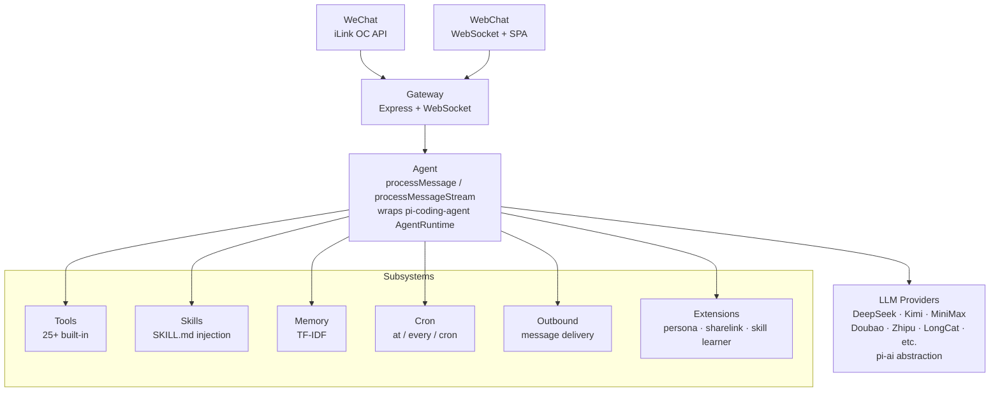

# Vex

Lightweight AI Chatbot Framework for the Chinese AI Ecosystem

[](https://github.com/counhopig/vex-bot)
[](LICENSE)
[](https://nodejs.org)

Vex is a TypeScript ESM chatbot framework built on `@mariozechner/pi-coding-agent` and `@mariozechner/pi-ai`. It connects to personal WeChat, runs in the browser via a server-rendered WebChat UI, and supports Chinese LLM providers alongside OpenAI/Anthropic-compatible APIs. Forked from [OpenMozi](https://github.com/oujingzhou/openmozi) (Apache 2.0), stripped to weixin-only, and rebranded as Vex.

---

## Features

- **Chinese model coverage** — DeepSeek, MiniMax, Kimi (Moonshot), Doubao (ByteDance), Zhipu, LongCat, StepFun, ModelScope, DashScope, plus custom OpenAI/Anthropic-compatible providers and Western backends (OpenAI, Ollama, OpenRouter, Together, Groq, Azure OpenAI, vLLM)
- **Personal WeChat** — connects to personal WeChat accounts via the iLink OC API long-polling channel for sending/receiving messages and files
- **WebChat UI** — built-in WebSocket-driven browser chat interface, server-rendered with no frontend build step
- **Control panel** — browser control surface for config editing, WeChat QR login, service status, and live backend logs
- **Web login protection** — local username/password registration and login backed by SQLite, with WebChat sessions and Weixin connections scoped per web user
- **Persona extension** — private persona state, emotion/effects/todos, and background user-profile extraction from chat history
- **3-tier plugin architecture** — bundled (`dist/`) → user-level (`~/.vex/`) → workspace (`./.vex/`) auto-discovery with lifecycle hooks
- **25+ built-in tools** — file read/write, bash execution, web search/scrape, browser automation, cron job management, memory access, sub-agent delegation, and system utilities
- **TF-IDF long-term memory** — automatic memory storage with TF-IDF retrieval injected into the agent context
- **Cron scheduling** — supports `at`, `every`, and standard cron expressions; triggers agent turns and system events on schedule
- **Playwright browser automation** — screenshots, form filling, and web interaction via headless Chromium
- **Skills injection** — SKILL.md system (YAML frontmatter + Markdown body) parsed and injected into the agent system prompt at runtime
- **Event hook system** — 12 event types with `on`/`once`/`off` registration for extending agent behavior
- **Docker support** — published GHCR image, multi-stage build (`node:20-alpine`), non-root user (`vex:vex`, UID/GID 1001), Compose files included
- **YAML config** — a single `config.local.yaml` format for all application configuration

## Architecture



| Subsystem | Location | Role |
|-----------|----------|------|
| Tools | `src/tools/` | Tool registration, validation, and execution engine |
| Skills | `src/skills/` | SKILL.md YAML+Markdown parsing and injection |
| Memory | `src/memory/` | TF-IDF vectorized long-term memory |
| Cron | `src/cron/` | at/every/cron schedule dispatching |
| Outbound | `src/outbound/` | Cross-channel unified message delivery |
| Extensions | `src/extensions/` | Built-in pipeline extensions: Persona, ShareLink, Skill Learner |
| Plugins | `src/plugins/` | 3-tier auto-discovery + lifecycle management |
| Browser | `src/browser/` | Playwright headless browser automation |
| Hooks | `src/hooks/` | 12 event type hook system |
| Sessions | `src/sessions/` | JSONL session persistence |

## Quick Start

### Install locally with npm

```bash
npm install -g vex-bot
vex --version
```

### Configure

```bash
vex onboard
```

The interactive configuration wizard walks you through: model providers (Chinese models, custom OpenAI/Anthropic endpoints), communication channels (personal WeChat), agent parameters (default model, temperature, max tokens), server port, and memory settings.

The config file is stored at `~/.vex/config.local.yaml`. Vex only reads YAML config files.

### Start

```bash
# Full startup (WebChat + WeChat channel)
vex start

# WebChat only (no channel configuration required)
vex start --web-only
```

Once running, open `http://localhost:PORT` in a browser to access the WebChat interface. Health check: `GET /health`.

### Deploy with Docker

```bash
docker compose up -d
```

The default Compose file pulls `ghcr.io/counhopig/vex-bot:latest`, starts WebChat-only mode, and persists state in the `vex-data` volume. For production, mount `config.local.yaml` into `/app/config.local.yaml`.

For contributor builds from the local Dockerfile, use:

```bash
docker compose -f docker-compose.dev.yml up -d --build
```

## CLI Commands

| Command | Description |
|---------|-------------|
| `vex onboard` | Interactive configuration wizard (models, channels, server, agent, memory) |
| `vex start` | Start the Gateway service (`--web-only` for WebChat only, `-p` to set port) |
| `vex status` | Check service status and health |
| `vex logs` | View logs (`-f` to tail, `-n` for line count, `--level` for severity filter) |
| `vex chat` | Terminal chat test (`-m` for model, `-p` for provider) |
| `vex check` | Validate configuration completeness |
| `vex models` | List configured available models |
| `vex kill` | Stop the running Vex service |
| `vex restart` | Restart the service |

## Configuration

`config.local.yaml` structure:

```yaml
providers:
  deepseek:
    apiKey: sk-xxx
  kimi:
    apiKey: sk-xxx
  minimax:
    apiKey: xxx
  custom-openai:
    baseUrl: https://api.example.com/v1
    apiKey: sk-xxx
    models:
      - id: qwen2.5-72b
        name: Qwen 2.5 72B
  custom-anthropic:
    baseUrl: https://api.example.com
    apiKey: sk-xxx
    models:
      - id: claude-3-5-sonnet
        name: Claude 3.5 Sonnet
channels:
  weixin:
    enabled: true
agent:
  defaultProvider: deepseek
  defaultModel: deepseek-chat
  temperature: 0.7
  maxTokens: 4096
  workingDirectory: /path/to/workspace
server:
  port: 3000
  host: 0.0.0.0
logging:
  level: info
  pretty: true
webAuth:
  enabled: true
  database: ~/.vex/web-auth.sqlite
memory:
  enabled: true
  embeddingProvider: deepseek
persona:
  enabled: true
  profile_building_enabled: true
  profile_building_trigger_turns: 5
```

Config loading is YAML-only: Vex loads `config.local.yaml` from the current directory, then `~/.vex/config.local.yaml`, and falls back to built-in defaults for missing fields.

## Project Structure

```
.
├── src/
│   ├── agents/          # Agent orchestration + session management (pi-coding-agent wrapper)
│   ├── gateway/         # Express HTTP/WS server, route dispatch
│   ├── channels/        # Platform adapters: personal WeChat (iLink OC API)
│   ├── tools/           # Tool registration, validation, execution engine (25 built-in tools)
│   ├── skills/          # SKILL.md injection system (YAML frontmatter + Markdown)
│   ├── plugins/         # 3-tier plugin auto-discovery (bundled/global/workspace)
│   ├── extensions/      # Built-in pipeline extensions (Persona, ShareLink, Skill Learner)
│   ├── memory/          # TF-IDF long-term memory with embedding
│   ├── cron/            # Scheduling: at/every/cron expressions
│   ├── outbound/        # Cross-channel unified message delivery
│   ├── web/             # Server-rendered WebChat SPA (inline HTML/CSS/JS)
│   ├── sessions/        # Session persistence (memory/file, JSONL transcripts)
│   ├── browser/         # Playwright headless browser automation
│   ├── hooks/           # Event hook system (12 event types, on/once/off)
│   ├── providers/       # Model resolution layer (pi-ai wrapper)
│   ├── config/          # YAML config loading + Zod validation
│   ├── cli/             # Commander.js CLI (9 subcommands, onboard wizard)
│   ├── commands/        # Chat command framework
│   ├── types/           # Shared TypeScript types
│   └── utils/           # Logger, crypto helpers
├── skills/              # Built-in skills
├── tests/               # Vitest tests
├── docs/                # Documentation
├── docker-compose.yml
└── Dockerfile
```

## Development

```bash
# Install from source for development
npm install
npm run build

# Development mode (TSX with auto-restart)
npm run dev

# Build
npm run build

# Run tests
npm test

# Start Gateway directly (bypass CLI)
npm run start:gateway
```

### Conventions

- **Strict TypeScript**: `noUncheckedIndexedAccess`, `noImplicitReturns`, `noFallthroughCasesInSwitch` enabled
- **ESM only**: `"type": "module"`, NodeNext module resolution, `.js` extensions in imports
- **Zod validation**: all config schemas defined as Zod objects in `src/config/index.ts`
- **Pino logging**: `getChildLogger("moduleName")` pattern for structured, namespaced loggers
- **Node >= 18**: minimum supported runtime

## Documentation

- [User Manual](./docs/user-manual.md)
- [Developer Guide](./docs/developer-guide.md)
- [API Reference](./docs/api-reference.md)

## License

[Apache-2.0](./LICENSE)

---

**Repository**: [https://github.com/counhopig/vex-bot](https://github.com/counhopig/vex-bot)
