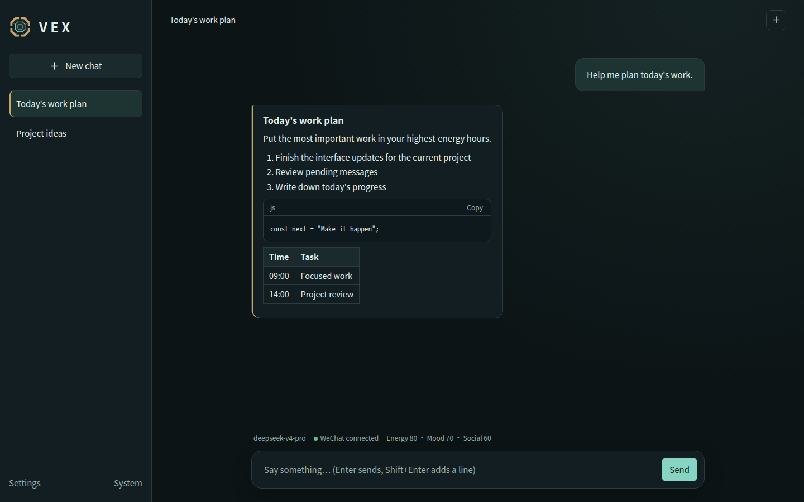
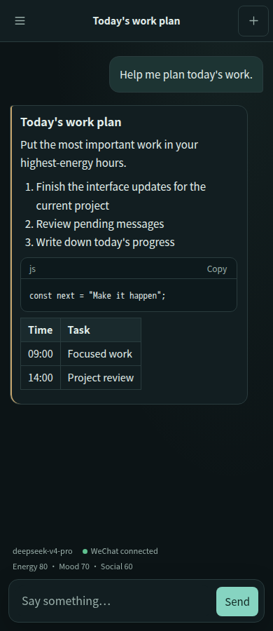

<div align="center">

# vex-bot

**A personal AI assistant that remembers you and gets things done.**

WeChat · WebChat · Long-term memory · Tools · Scheduled tasks


[](https://github.com/counhopig/vex-bot/pkgs/container/vex-bot)

[Quick start](#quick-start) · [Features](#features) · [Configuration](#configuration) · [Documentation](#documentation)

</div>

Vex is a self-hosted AI assistant for one owner. Talk to it on personal WeChat or in your browser: ask it to research a topic, work with files, remember your preferences, or run a task on a schedule.

One daemon, `vexd`, connects both interfaces to the same workspace, long-term memory, tools and approval queue. Each conversation keeps its own history.



<details>
<summary>Mobile preview</summary>



</details>

*WebChat previews with a sample conversation.*

## Features

- **WeChat and WebChat.** One permanent WeChat conversation and multiple browser conversations. WebChat includes streaming Markdown, code copying, automatic titles, history recovery, response interruption, light and dark themes, and a mobile conversation drawer.
- **Memory that carries across conversations.** Preferences and long-term facts live in editable Markdown files, with full-text search, memory preservation during context compaction, and nightly consolidation.
- **Tools that act.** Read and write files, run shell commands, search and fetch the web, and delegate work to isolated sub-agents. Connect MCP servers over stdio or Streamable HTTP, and extend the assistant with Skills.
- **Your notes as a knowledge base.** Point Vex at an Obsidian vault, from a folder or a git repository, and it searches and reads your notes, read-only, following links and tags.
- **Shared approvals.** Shell commands, MCP tools and writes outside the workspace ask for approval. Respond from either WeChat or WebChat; the first answer applies.
- **Tasks on your schedule.** Create recurring or one-time tasks in conversation or under Settings → Schedules. Heartbeat checks and proactive WeChat messages follow configurable rest hours.
- **Your assistant, your workspace.** Edit its persona, what it knows about you, memory and daily notes directly in WebChat. Run one Node.js process or one container, with configuration and stored data under one data directory.

Bundled Skills cover weather, image understanding and share-link reading for Bilibili, YouTube, Douyin and Xiaohongshu. Bilibili and YouTube videos without subtitles can be transcribed through a configured OpenAI-compatible speech-to-text service or Xiaomi MiMo. Web search supports Tavily, Brave and self-hosted SearXNG.

## Quick start

### Docker

```bash
curl -O https://raw.githubusercontent.com/counhopig/vex-bot/main/compose.yaml
docker-compose run --rm vex onboard
docker-compose up -d
```

The setup wizard asks for your model provider and API key, offers optional WeChat QR login, and prints the WebChat access token. To change the host port, edit `compose.yaml`.

Open <http://127.0.0.1:7860> and sign in with the token. If WeChat is not linked, run `docker-compose logs -f` and scan the QR code shown in the log.

The image `ghcr.io/counhopig/vex-bot:latest` supports `linux/amd64` and `linux/arm64`. Docker Hub publishing is also available when the repository's Docker Hub secrets are configured.

### From source

Requires **Node.js 24 or later**. If a prebuilt `better-sqlite3` binary is unavailable, installation also requires C/C++ build tools.

```bash
git clone https://github.com/counhopig/vex-bot.git
cd vex-bot
npm ci
npm run build
npm link
vex onboard
vex start -d
```

For foreground logs, use `vex start` instead of `vex start -d`.

## Configuration

Vex stores its configuration and workspace under `~/.vex` by default. Set `VEX_HOME` to use another location; the CLI and daemon must use the same value.

A minimal `~/.vex/config.yaml`:

```yaml
model:
  provider: minimax-cn
  id: MiniMax-M2.7
providers:
  minimax-cn:
    apiKey: "YOUR_API_KEY"
```

WebChat settings provide forms for model and service configuration, a YAML editor, scheduled tasks and workspace files:

| File | Content |
| --- | --- |
| `SOUL.md` | Persona |
| `USER.md` | What Vex knows about you |
| `MEMORY.md` | Long-term facts |
| `HEARTBEAT.md` | Periodic checks |
| `memory/YYYY-MM-DD.md` | Daily notes |

Model and service requests use your configured providers. Self-hosting keeps configuration and stored conversations in your environment; it does not imply that model inference runs locally.

See the [configuration reference](docs/configuration.md) for providers, custom models, search, speech-to-text, MCP and Skills.

## Everyday use

| Command | Description |
| --- | --- |
| `vex onboard [--force]` | Set up the model, API key, port and optional WeChat connection |
| `vex start [-d]` | Run in the foreground or background |
| `vex stop` | Stop the background daemon |
| `vex status` | Check whether the daemon is running |
| `vex logs [-f]` | Show or follow logs |
| `vex wechat login` | Link WeChat by QR code |

WebChat listens on port `7860` by default. In Docker, use the host port configured in `compose.yaml`.

On WeChat, Vex answers only its owner. Send `/stop` to interrupt a reply, or `/y`, `/ya` and `/n` to approve once, approve for the session, or deny the oldest pending approval.

Ask Vex to create scheduled tasks or write new Skills. Use WebChat to manage conversations, inspect tool activity and edit the workspace.

## Documentation

- [Architecture](docs/architecture.md) — sessions, context, memory, persona and scheduling.
- [Configuration](docs/configuration.md) — settings, providers, environment variables, MCP and Skills.
- [Deployment and operations](docs/operations.md) — Docker, source installation, WeChat linking and troubleshooting.
- [Samples](docs/samples/) — configuration files, a heartbeat checklist and a Skill.

## Development

```bash
npm ci
npm run dev      # Run from source
npm run lint     # Type check
npm test         # Tests with scripted models and local services
npm run build   # Compile and copy browser and Skill assets
```

Tests do not require model credentials. The full build includes static assets and bundled Skills.

Pushes to `main` run checks and publish container images; `v*` tags publish versioned images. Pull requests run checks and build images without publishing them.

Bug reports and contributions are welcome through [issues](https://github.com/counhopig/vex-bot/issues) and [pull requests](https://github.com/counhopig/vex-bot/pulls).
